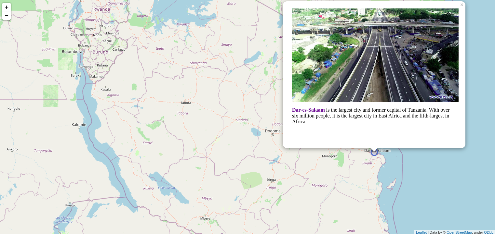
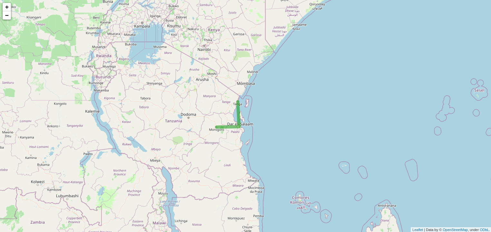

# Folium-visualization-examples

Examples when doing spatial visualization with folium  in Python

Available Examples

- [x] [Adding Image Marker to Folium Maps]()
- [x] [Drawing Routes with Polyline]()

## Adding Image Marker to Folium Maps

In this example you learn how to develop interactive maps with image marker + descriptions just as shown in the example output below;

## Drawing Routes

Folium Polyline can help you draw routes between points but just making a straightline through them just as shown below, which can be of least use in our dailycase where we are more interested on the real routes such as (driver route, walk route, and ..) but there cases you may need it . 

For incase you're interested on drawing those routes which ofcouse you're , you might wanna take alook at these library and Examples they help you  do that with python;
- [Networkx](https://github.com/networkx/networkx) + [Osmnx](https://github.com/gboeing/osmnx)
- [Here examples on how to that](https://github.com/gboeing/osmnx-examples/blob/main/notebooks/11-plot-routes-folium-web-map.ipynb)

## Issues

Facing issue while trying to run any of the mentioned example, raise one  so as we can fix it as soon as we can.

## Contribute

You're welcome to add more detailed examples on how to visualize spatial data with folium just fork it (JFI) !

## Credits

All the credits to [kalebu](https://github.com/kalebu)